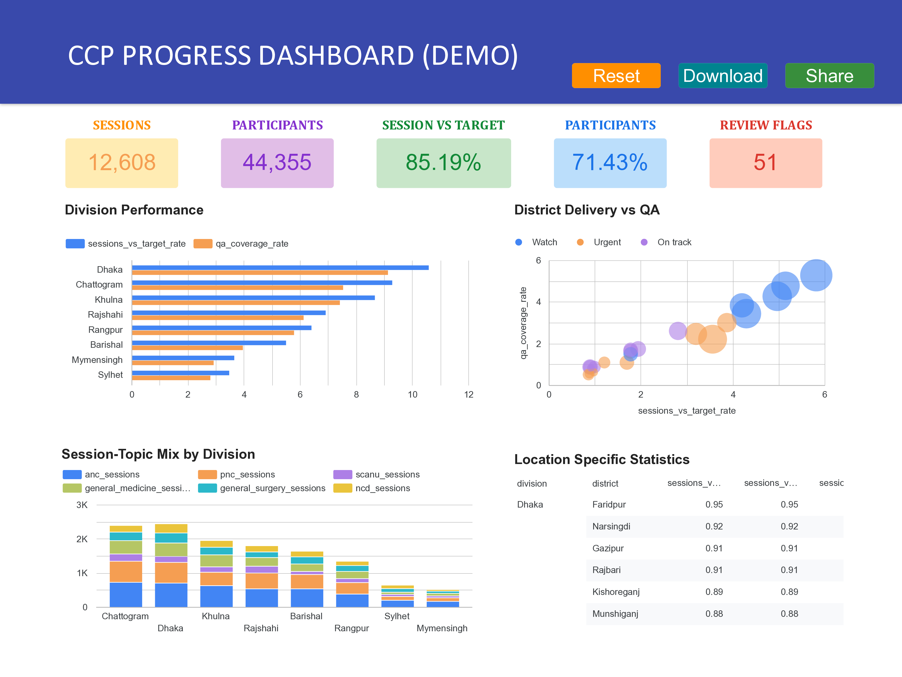

```{r setup, include=FALSE}
knitr::opts_chunk$set(
  echo = FALSE,
  warning = FALSE,
  message = FALSE,
  fig.width = 7.2,
  fig.height = 4.2,
  dpi = 150
)

library(dplyr)
library(ggplot2)
library(knitr)
library(readxl)
library(scales)
library(stringr)
library(writexl)
library(kableExtra)

options(dplyr.summarise.inform = FALSE, scipen = 999)
```

<style>
.mainquestion {
  color: #C2185B;
  background: #FCE4EC;
  border-left: 5px solid #C2185B;
  padding: 10px 14px;
  margin: 14px 0;
  font-weight: 700;
}
.subquestion {
  color: #2E7D32;
  background: #E8F5E9;
  border-left: 4px solid #43A047;
  padding: 8px 12px;
  margin: 12px 0;
  font-weight: 600;
}
.figurecaption {
  text-align: center;
  font-size: 0.92em;
  margin: 6px auto 16px auto;
  max-width: 88%;
}
table th,
table td {
  padding-top: 0.3em;
  padding-bottom: 0.3em;
}
a,
a:visited,
a:hover,
a:active {
  color: #003366;
  text-decoration: underline;
  text-decoration-thickness: 0.08em;
  text-underline-offset: 0.14em;
}
</style>

```{=latex}
\let\reporthref\href
\renewcommand{\href}[2]{\reporthref{#1}{\textcolor{deepblue}{\underline{#2}}}}
\let\reporthyperlink\hyperlink
\renewcommand{\hyperlink}[2]{\reporthyperlink{#1}{\textcolor{deepblue}{\underline{#2}}}}
```

# Scope and method

I use R coding language (R Markdown, LaTeX functions, PDF and HTML exports) to complete this assignment because it can be checked, repeated, and updated if the source files changes. I choose R also to depict my capability in producing dynamic and automated qualitative + quantitative analytic reports in cases of recurring reporting. For convenience of the reviewer, I did not include the codes in the PDF output; however, I have prepared a separate HTML document, which contains both code and outputs for detailed inspection which can be provided upon follow-up request. Additionally, I have added detailed explanations and notes (where necessary) for improved understanding.
I have put all the data operations (cleaning/wrangling) in the section 2 along with some summary table for my and reviewer's understanding of the data. Therefore, section 2 can be considered as optional to review. I intentionally put this section for the reviewer if interested in understanding the complete process of my analytic thinking and reporting approach.

The main answer to question starts from section 3 to 6. I have included the questions in reddish-pink boxes above each answer sections (PDF document) to separate the responses by individual questions.

## Why I chose R for this assignment
**Reproducible dynamic reports:** Once format is developed, I don't need to worry about any formatting issues unlike MS Word in case of regenerating quality report with proper structure every time I make any changes. **Error management:** Reduced scope of tabulation error. **Data-driven document:** I do not need to manually input the results in the qualitative report rather I directly generate the document alongside the analysis.

**Data sources:**  
`1. Average_sessions_details.xlsx` and

`2. CCP_Monitoring_Data.xlsx`

**Assignment instructions:** `Monitoring Manager Assignment.pdf`


```{r import-functions}
# Purpose: standardize text before comparing or joining names.
# Input: any text column (for example, district or facility names).
# Output: the same text with consistent apostrophes and extra spaces removed.
clean_text <- function(x) {
  x |>
    as.character() |>               # Ensure every value is treated as text.
    str_replace_all("[‘’]", "'") |>  # Change smart apostrophes to a standard apostrophe.
    str_squish()                      # Remove leading, trailing, and repeated spaces.
}

# Purpose: create a comparison-only version of a name to find hidden duplicates.
# Input: cleaned or uncleaned names.
# Output: lowercase letters/numbers only; this key is never shown as the final name.
string_key <- function(x) {
  x |>
    clean_text() |>                       # Apply the basic text cleanup above.
    iconv(to = "ASCII//TRANSLIT") |>        # Convert unusual characters to plain text.
    str_to_lower() |>                        # Ignore capitalization differences.
    str_replace_all("[^a-z0-9]", "")           # Ignore punctuation and spaces when comparing.
}

# Reviewed spelling map: left side is the source variation; right side is the chosen name.
district_name_crosswalk <- c(
  "Bogra" = "Bogura",
  "Jhalakathi" = "Jhalokathi",
  "Laxmipur" = "Lakshmipur",
  "Narshingdi" = "Narsingdi",
  "Sariatpur" = "Shariatpur",
  "Thakurgaong" = "Thakurgaon"
)

# The same reviewed spelling corrections when a district appears inside a longer facility name.
# In these patterns, `\\b` means "whole word" so part of another word is not replaced.
facility_location_patterns <- c(
  "\\bBogra\\b" = "Bogura", "\\bJhalakathi\\b" = "Jhalokathi",
  "\\bLaxmipur\\b" = "Lakshmipur", "\\bNarshingdi\\b" = "Narsingdi",
  "\\bSariatpur\\b" = "Shariatpur", "\\bThakurgaong\\b" = "Thakurgaon",
  "\\bKhagrachari\\b" = "Khagrachhari", "\\bBola\\b" = "Bhola",
  "\\bMoulavibazar\\b" = "Moulvibazar", "\\bKustia\\b" = "Kushtia",
  "\\bChaattogram\\b" = "Chattogram", "\\bLaksmipur\\b" = "Lakshmipur",
  "\\bPatukhali\\b" = "Patuakhali", "\\bSulhet\\b" = "Sylhet"
)

# Purpose: flag unusually high or low values for review without changing them.
# Input: a numeric column and a multiplier; 3 gives a conservative review threshold.
# Output: TRUE for unusual observations and FALSE for observations within the range.
iqr_outlier <- function(x, multiplier = 3) {
  quartiles <- quantile(x, c(0.25, 0.75), na.rm = TRUE) # Middle 50% boundaries.
  spread <- diff(quartiles)                             # Interquartile range (IQR).

  # If every value is effectively the same, none can be classified as unusual.
  if (!is.finite(spread) || spread == 0) return(rep(FALSE, length(x)))

  # Return flags only; the original values remain unchanged.
  x < quartiles[1] - multiplier * spread |
    x > quartiles[2] + multiplier * spread
}
```

# Data Cleaning & Improvements

```{r import-and-clean}
monitor_raw <- read_excel("CCP_Monitoring_Data.xlsx")
history_raw <- read_excel("Average_sessions_details.xlsx")

monitor_raw_names <- names(monitor_raw)

monitor <- monitor_raw
history <- history_raw

# Issue: one source header says "Surgury"; rename fields without changing values.
monitor <- monitor |>
  rename(
    division = Division,
    district = District,
    facilities = Facilities,
    anc_sessions = `ANC Sessions`,
    pnc_sessions = `PNC Sessions`,
    scanu_sessions = `SCANU Sessions`,
    general_medicine_sessions = `General Medicine Sessions`,
    general_surgery_sessions = `General Surgury Sessions`,
    ncd_sessions = `NCD Sessions`,
    total_patients = `Total Patients`,
    total_caregivers = `Total Caregivers`,
    trainers = Trainers,
    avg_sessions_week = `Avg Sessions/Week`,
    avg_participants_session = `Avg Participants/Session`,
    sessions_vs_target_pct = `% Sessions vs Target`,
    ccp_quality_assessment_coverage_pct = `CCP Quality Assessment Coverage %`
  )

history <- history |>
  rename(
    active_since = `Active since`,
    division = Division,
    district = District,
    facility_type = `Facility Type`,
    facility_name = `Facility name`,
    total_number_of_sessions = `Total number of sessions`,
    average_monthly_sessions = `Average monthly sessions`,
    total_number_of_participants = `Total number of participants`,
    average_monthly_participants = `Average monthly participants`
  )

required_monitor <- c(
  "division", "district", "facilities", "anc_sessions", "pnc_sessions",
  "scanu_sessions", "general_medicine_sessions", "general_surgery_sessions",
  "ncd_sessions", "total_patients", "total_caregivers", "trainers",
  "avg_sessions_week", "avg_participants_session", "sessions_vs_target_pct",
  "ccp_quality_assessment_coverage_pct"
)
required_history <- c(
  "active_since", "division", "district", "facility_type", "facility_name",
  "total_number_of_sessions", "average_monthly_sessions",
  "total_number_of_participants", "average_monthly_participants"
)

stopifnot(all(required_monitor %in% names(monitor)))
stopifnot(all(required_history %in% names(history)))

monitor_numeric <- setdiff(required_monitor, c("division", "district"))
history_numeric <- c(
  "active_since", "total_number_of_sessions", "average_monthly_sessions",
  "total_number_of_participants", "average_monthly_participants"
)

# readxl reads each column type; stop with a clear message if a number column contains text.
numeric_type_failures <-
  sum(!vapply(monitor[monitor_numeric], is.numeric, logical(1))) +
  sum(!vapply(history[history_numeric], is.numeric, logical(1)))
stopifnot(numeric_type_failures == 0)

monitor <- monitor |>
  mutate(
    source_row = row_number() + 1L,
    division_original = as.character(division),
    district_original = as.character(district),
    division_raw = clean_text(division_original),
    district_raw = clean_text(district_original),
    division = recode(division_raw, "Barisal" = "Barishal"),
    district = recode(district_raw, !!!as.list(district_name_crosswalk))
  )

history <- history |>
  mutate(
    source_row = row_number() + 1L,
    division_original = as.character(division),
    district_original = as.character(district),
    facility_type_original = as.character(facility_type),
    facility_name_original = as.character(facility_name),
    division_raw = clean_text(division_original),
    district_raw = clean_text(district_original),
    facility_type = clean_text(facility_type),
    facility_name = clean_text(facility_name_original) |>
      str_replace_all("\\s*,+\\s*", ", ") |>
      str_replace_all(facility_location_patterns) |>
      str_remove(",\\s*$") |>
      str_squish(),
    division = recode(division_raw, "Barisal" = "Barishal"),
    district = recode(district_raw, !!!as.list(district_name_crosswalk))
  )

# Issue: curly apostrophes and spelling differences stop the same place names from matching.
# Fix: make punctuation consistent and correct only the known place-name differences above.

# Issue: facility names contain line breaks, extra spaces, misplaced commas, and place-name typos.
# Fix: tidy the spaces and commas, then correct only the place names checked above.
facility_name_fixes <- history |>
  filter(facility_name_original != facility_name) |>
  transmute(
    row = source_row,
    original = facility_name_original,
    corrected = facility_name
  )

session_fields <- c(
  "anc_sessions", "pnc_sessions", "scanu_sessions",
  "general_medicine_sessions", "general_surgery_sessions", "ncd_sessions"
)

monitor <- monitor |>
  mutate(
    total_sessions_quarter = rowSums(across(all_of(session_fields)), na.rm = FALSE),
    total_participants = total_patients + total_caregivers,
    calculated_sessions_week = total_sessions_quarter / 13,
    calculated_participants_session = total_participants / total_sessions_quarter
  )

# Issue: four monitoring rows use city units, while the older file uses their parent districts.
# Fix: keep the original district and use a second district name only for a fair comparison.
monitor <- monitor |>
  mutate(
    comparison_district = case_when(
      district == "Chattogram City" ~ "Chattogram",
      district %in% c("Dhaka North City", "Dhaka South City") ~ "Dhaka",
      district == "Khulna City" ~ "Khulna",
      TRUE ~ district
    )
  )

history <- history |>
  mutate(
    comparison_district = district,
    implied_months_sessions = total_number_of_sessions / average_monthly_sessions,
    implied_months_participants = total_number_of_participants / average_monthly_participants,
    calculated_participants_session = total_number_of_participants / total_number_of_sessions,
    average_participants_session = average_monthly_participants / average_monthly_sessions
  ) |>
  group_by(facility_type) |>
  mutate(
    unusual_monthly_sessions = iqr_outlier(average_monthly_sessions),
    unusual_participants_session = iqr_outlier(calculated_participants_session)
  ) |>
  ungroup()

monitor <- monitor |>
  group_by(division) |>
  mutate(
    unusual_target_pct = iqr_outlier(sessions_vs_target_pct),
    unusual_qa_pct = iqr_outlier(ccp_quality_assessment_coverage_pct),
    unusual_sessions_per_facility = iqr_outlier(total_sessions_quarter / facilities),
    unusual_participants_session = iqr_outlier(calculated_participants_session)
  ) |>
  ungroup()

# Issue: a very high or low value may be a mistake, but it may also be real.
# Fix: mark values outside the 3-IQR range for checking and do not change them.
```

::: {.subquestion latex=true}
**In data processing** I checked, cleaned, and reconciled the two provided data sources before answering tasks. The original values were kept unless a spelling, punctuation, whitespace, or header correction was required.
:::

**Table 1: Problems found and how they were handled**

```{r validation-audit}
monitor_district <- monitor |>
  group_by(division, comparison_district) |>
  summarise(
    monitoring_rows = n(),
    facilities_monitoring = sum(facilities),
    reported_quarter_sessions = sum(total_sessions_quarter),
    reported_quarter_participants = sum(total_participants),
    .groups = "drop"
  )

history_district <- history |>
  group_by(division, comparison_district) |>
  summarise(
    facilities_history = n_distinct(facility_name),
    expected_quarter_sessions = sum(average_monthly_sessions) * 3,
    expected_quarter_participants = sum(average_monthly_participants) * 3,
    .groups = "drop"
  )

district_comparison_all <- full_join(
  monitor_district,
  history_district,
  by = c("division", "comparison_district")
) |>
  mutate(
    join_status = case_when(
      is.na(reported_quarter_sessions) ~ "History only",
      is.na(expected_quarter_sessions) ~ "Monitoring only",
      TRUE ~ "Matched"
    ),
    facility_count_gap = facilities_monitoring - facilities_history,
    session_gap = reported_quarter_sessions - expected_quarter_sessions,
    session_gap_pct = session_gap / expected_quarter_sessions
  )

# Issue: both files total 658 facilities, but most district counts differ.
# Fix: do not move records without a dated matching list; show every difference.

# Issue: the brief says 8 facility categories, while the workbook contains 9.
# Fix: keep all 9 categories found in the file and note that the brief says 8.

# Issue: only the start year is given, and the two files may cover different periods.
# Fix: use monthly average x 3 only as a rough comparison and clearly state this limit.

monitor_count_fields <- c(
  "facilities", session_fields, "total_patients", "total_caregivers", "trainers"
)
history_count_fields <- c(
  "active_since", "total_number_of_sessions", "total_number_of_participants"
)

non_finite_numeric <-
  sum(is.infinite(unlist(monitor[monitor_numeric])) |
        is.nan(unlist(monitor[monitor_numeric])), na.rm = TRUE) +
  sum(is.infinite(unlist(history[history_numeric])) |
        is.nan(unlist(history[history_numeric])), na.rm = TRUE)

non_positive_counts <-
  sum(unlist(monitor[monitor_count_fields]) <= 0, na.rm = TRUE) +
  sum(unlist(history[setdiff(history_count_fields, "active_since")]) <= 0, na.rm = TRUE)

non_integer_counts <-
  sum(abs(unlist(monitor[monitor_count_fields]) -
            round(unlist(monitor[monitor_count_fields]))) > 1e-9, na.rm = TRUE) +
  sum(abs(unlist(history[history_count_fields]) -
            round(unlist(history[history_count_fields]))) > 1e-9, na.rm = TRUE)

normalized_facility_duplicates <- history |>
  mutate(name_key = string_key(facility_name)) |>
  count(name_key) |>
  filter(name_key != "", n > 1)

normalized_district_duplicates <- monitor |>
  mutate(district_key = string_key(district)) |>
  count(division, district_key) |>
  filter(district_key != "", n > 1)

district_division_conflicts <- bind_rows(
  monitor |> transmute(source = "Monitoring", division, district = comparison_district),
  history |> transmute(source = "Historical", division, district = comparison_district)
) |>
  distinct() |>
  group_by(district) |>
  filter(n_distinct(division) > 1) |>
  ungroup()

history_month_denominator_failures <- sum(
  abs(history$implied_months_sessions - history$implied_months_participants) > 0.01,
  na.rm = TRUE
)
history_participant_ratio_failures <- sum(
  abs(history$calculated_participants_session - history$average_participants_session) > 0.01,
  na.rm = TRUE
)
history_non_integer_months <- sum(
  abs(history$implied_months_sessions - round(history$implied_months_sessions)) > 0.01,
  na.rm = TRUE
)

monitor_anomaly_rows <- sum(
  monitor$unusual_target_pct |
    monitor$unusual_qa_pct |
    monitor$unusual_sessions_per_facility |
    monitor$unusual_participants_session,
  na.rm = TRUE
)
history_anomaly_rows <- sum(
  history$unusual_monthly_sessions | history$unusual_participants_session,
  na.rm = TRUE
)

weekly_check_failures <- sum(
  abs(monitor$avg_sessions_week - monitor$calculated_sessions_week) > 0.11,
  na.rm = TRUE
)
participant_check_failures <- sum(
  monitor$avg_participants_session != round(monitor$calculated_participants_session),
  na.rm = TRUE
)

validation_checks <- tibble(
  check = c(
    "Numeric conversion failures", "Missing required values", "Exact duplicate rows",
    "Normalized-key duplicates", "Non-finite values", "Negative values",
    "Non-positive counts", "Fractional counts", "Invalid percentages",
    "Monitoring formula mismatches", "Historical formula mismatches",
    "Future activation years", "Division conflicts", "Unmatched geographies"
  ),
  failures = c(
    numeric_type_failures,
    sum(is.na(monitor[required_monitor])) + sum(is.na(history[required_history])),
    sum(duplicated(monitor_raw)) + sum(duplicated(history_raw)),
    nrow(normalized_district_duplicates) + nrow(normalized_facility_duplicates),
    non_finite_numeric,
    sum(unlist(monitor[monitor_numeric]) < 0, na.rm = TRUE) +
      sum(unlist(history[history_numeric]) < 0, na.rm = TRUE),
    non_positive_counts,
    non_integer_counts,
    sum(monitor$sessions_vs_target_pct < 0 | monitor$sessions_vs_target_pct > 100) +
      sum(monitor$ccp_quality_assessment_coverage_pct < 0 |
            monitor$ccp_quality_assessment_coverage_pct > 100),
    weekly_check_failures + participant_check_failures,
    history_month_denominator_failures + history_participant_ratio_failures +
      history_non_integer_months,
    sum(history$active_since > as.integer(format(Sys.Date(), "%Y")), na.rm = TRUE),
    nrow(district_division_conflicts),
    sum(district_comparison_all$join_status != "Matched")
  )
)

issue_log <- tibble(
  issue = c(
    "Misspelled header",
    "Location spelling/punctuation variants", "City-vs-district geography",
    "Facility-name formatting/location variants", "Facility categories vs brief",
    "District facility-count disagreement", "Unspecified averaging window",
    "Unusual monitoring values", "Unusual historical values"
  ),
  Frequency = c(
    sum(monitor_raw_names == "General Surgury Sessions"),
    sum(monitor$division_original != monitor$division |
          monitor$district_original != monitor$district) +
      sum(history$division_original != history$division |
            history$district_original != history$district),
    sum(monitor$district != monitor$comparison_district),
    nrow(facility_name_fixes),
    n_distinct(history$facility_type),
    sum(district_comparison_all$facility_count_gap != 0, na.rm = TRUE),
    nrow(history),
    monitor_anomaly_rows,
    history_anomaly_rows
  ),
  Improvements = c(
    "Fixed spelling in the column name",
    "Made spelling, spacing, & punctuation consistent",
    "Kept the city rows & used parent districts when comparing files",
    "Fixed spacing, commas, & clear location spelling errors",
    "Kept all 9 identified facility types in the historic data & noted that the brief says 8",
    "Kept both dataset counts & marked the districts that need checking",
    "Used the given monthly averages & clearly stated the limitation",
    "Kept the values & marked them for checking",
    "Kept the values & marked them for checking"
  )
)
kable(issue_log, align = c("l", "r", "l"))
```

After a successful data wrangling and cleaning, the `r nrow(validation_checks[-7,])` basic format and validation checks were conducted and found no errors. The following are the list of validation checks.

**Table 2: Data validation checks**

```{r validation-finding}
validation_checks[-7,] |>
  kable(align = c("l", "r", "l")) |>
  kableExtra::kable_styling(position = "left")
```

## Data Review and Cleaning Summary

The monitoring file has `r nrow(monitor)` reporting areas. For the cross-file comparison only (in the joined dataset). I have summarized the historical data (Average_sessions_details.xlsx) up to district level to match the format of monitoring data (CCP_Monitoring_Data.xlsx) before comparing. I grouped `r sum(monitor$district != monitor$comparison_district)` city rows (from monitoring data) with their respective parent districts, resulting in `r nrow(district_comparison_all)` unique comparable districts as expected. Both files cover `r sum(monitor$facilities)` facilities in total, but `r sum(district_comparison_all$facility_count_gap != 0, na.rm = TRUE)` of those districts have different facility counts. I kept both counts because the files do not show which one is the latest data (need to review the data and identify the correct facility information). In doing all these data wrangling I performed the following sets of corrections:

**Table 3: Location names that were fixed**

_Note_: I developed custom functions (see the code in HTML version) to operate the validation checks and improvements.

```{r location-fixes-table}
location_fixes <- bind_rows(
  monitor |>
    filter(district_original != district | division_original != division) |>
    transmute(source = "Monitoring", field = "Location", original = paste(division_original, district_original, sep = " / "), corrected = paste(division, district, sep = " / ") ),
  history |>
    filter(district_original != district | division_original != division) |>
    distinct(division_original, district_original, division, district) |>
    transmute(source = "Historical", field = "Location", original = paste(division_original, district_original, sep = " / "), corrected = paste(division, district, sep = " / ") )
) |>
  distinct()

kable(location_fixes)

```


In addition, while checking for data errors, I identified that the provided historic data contains 9 distinct types of facilities; however, in the assignment brief it was mentioned that there are 8 facility types. Being unable to identify the accurate value, I kept the source facility type data unchanged.

\newpage

**Table 4: Examples of facility names that were fixed**

```{r facility-name-fixes}
kable(head(facility_name_fixes, 10))
```

In the historical data file there are `r nrow(facility_name_fixes)` facility-name fixes in total. They cover line breaks, apostrophes, commas, spacing, and clear district spelling errors. I did not change other words because there is no official facility list in the files.

**Table 5: Subset of value review table**

```{r anomaly-review}
anomaly_review <- bind_rows(
  monitor |>
    filter(unusual_target_pct) |>
    transmute(source = "Monitoring", row = source_row,
              location = paste(division, district, sep = " / "),
              indicator = "Sessions vs target %", value = sessions_vs_target_pct),
  monitor |>
    filter(unusual_qa_pct) |>
    transmute(source = "Monitoring", row = source_row,
              location = paste(division, district, sep = " / "),
              indicator = "QA coverage %", value = ccp_quality_assessment_coverage_pct),
  monitor |>
    filter(unusual_sessions_per_facility) |>
    transmute(source = "Monitoring", row = source_row,
              location = paste(division, district, sep = " / "),
              indicator = "Sessions per facility", value = total_sessions_quarter / facilities),
  monitor |>
    filter(unusual_participants_session) |>
    transmute(source = "Monitoring", row = source_row,
              location = paste(division, district, sep = " / "),
              indicator = "Participants per session", value = calculated_participants_session),
  history |>
    filter(unusual_monthly_sessions) |>
    transmute(source = "Historical", row = source_row,
              location = paste(division, district, sep = " / "),
              indicator = "Average monthly sessions", value = average_monthly_sessions),
  history |>
    filter(unusual_participants_session) |>
    transmute(source = "Historical", row = source_row,
              location = paste(division, district, sep = " / "),
              indicator = "Participants per session", value = calculated_participants_session)
) |>
  arrange(source, indicator, desc(value))

anomaly_display <- bind_rows(
  anomaly_review |> filter(source == "Monitoring"),
  anomaly_review |> filter(source == "Historical") |> slice_head(n = 8)
)
kable(anomaly_display |> mutate(value = round(value, 1)))
```

The full value review table contains `r nrow(anomaly_review)` flags. Here, for both datasets, I have compared each value only with similar records in that groups. For example, in the monitoring dataset, districts were compared with other districts in the same division. Similarly, in the historical dataset, facilities were compared with other facilities of the same type. Now, a value is flagged when it was far outside the usual range of its comparison group (in statistical terms, I have considered the calculation of three times the interquartile range (IQR), separately for each comparison group). This was a empirical check, designed to identify only very unusual results. So, in simple terms, flags do not mean the values are incorrect; they indicate records that should be verified against source documents.  
  
Four monitoring districts have unusually low sessions-versus-target results compared with other districts in their divisions: Dhaka (35.7%), Narayanganj (39.6%), Dinajpur (38.0%), and Noakhali (44.2%). The other 20 flags are historical facilities with unusually high average monthly sessions compared with facilities of the same type: 14 Upazila Health Complexes, 3 District Hospitals, 2 Medical College Hospitals, and 1 Specialized Hospital. No unusual values were found for QA coverage, sessions per facility, or participants per session. These are statistical review signals, not confirmed errors; high-volume facilities or genuine delivery problems could explain them, so I retained every value and marked it for verification.

\newpage

**Table 6: Estimated number of months behind the historical averages**

```{r averaging-window-review}
averaging_window_review <- history |>
  group_by(active_since) |>
  summarise(
    facilities = n(),
    minimum_implied_months = min(implied_months_sessions),
    median_implied_months = median(implied_months_sessions),
    maximum_implied_months = max(implied_months_sessions),
    .groups = "drop"
  ) |>
  mutate(across(ends_with("months"), ~ round(.x, 1)))

kable(averaging_window_review)
```

Here, the implied month is calculated as: Total sessions ÷ Average monthly sessions = implied number of months $\approx$ Total participants ÷ monthly participants. The session and participant averages use the same number of months for every facility, which is a good sign. However, facilities with the same start year often have very different month counts (depicted in minimum, median and maximum active month counts). Since the file provides data summarized at a single time point, I used the monthly averages as given. More detailed longitudinal data (longer timeline data) could help to uncover more insights from the data.

# A. Quantitative analysis and management recommendations

## Task A1 — Division roll-up and ranking

::: {.mainquestion latex=true}
**Task A1:** Using `CCP_Monitoring_Data`, roll up the district-level figures to division level and calculate a division-level “% Sessions vs Target” (weighted by session volume, not a simple average of the district percentages). Rank the 8 divisions from strongest to weakest.
:::

### Answer

**Calculation method**

Following the given instruction, I have considered aggregating all sessions to be used as weights. However, I have used statistical function to calculate the weighted average to preserve the weighted session vs target percent scale (0-100). [**Click me**](https://www.geeksforgeeks.org/maths/weighted-average-formula/) for more details on weighted average calculation.

So in order to achieve the weighted average, _**step 1:**_ for district (d), total quarterly sessions are the sum of the six condition-area session fields:

$$
S_d = ANC_d + PNC_d + SCANU_d + GM_d + GS_d + NCD_d
$$

Now, _**step 2:**_ for division (v), the session volume weighted, session vs target percentage is:

$$
Weighted\ Session\ vs\ Target\ \%_v =
\frac{\sum_{d \in v}\left(session\ vs\ Target\ \%_d \times S_d\right)}
{\sum_{d \in v} S_d}
$$

The calculation keeps the resulted "Weighted Session vs Target %" measure in same unit (%) as the source "Session vs Target %" while taking account of the aggregated session counts as weights and summarized at division level (as required in the question). Then, divisions are ranked in descending order of this weighted result "Weighted Session vs Target %" or simply "Weighted Target %".

_Please note that here:_

1. The subscript d stands for district and

2. The subscript v stands for division

\newpage

[**Table 7: Division ranking from strongest to weakest**]{#table-7}

_**Note**_: to save column name space in the table I shortened "Weighted Session vs Target %" to "Weighted Target %"

```{r division-results}
division_results <- monitor |>
  group_by(division) |>
  summarise(
    weighted_target_pct = weighted.mean(sessions_vs_target_pct, total_sessions_quarter),
    weighted_qa_pct = weighted.mean(ccp_quality_assessment_coverage_pct, facilities),
    districts = n(),
    facilities = sum(facilities),
    sessions = sum(total_sessions_quarter),
    participants = sum(total_participants),
    trainers = sum(trainers),
    sessions_per_facility = sessions / facilities,
    facilities_per_trainer = facilities / trainers,
    .groups = "drop"
  ) |>
  arrange(desc(weighted_target_pct)) |>
  mutate(performance_rank = row_number())

division_rank_table <- division_results |>
  transmute(
    Rank = performance_rank,
    Division = division,
    Facilities = facilities,
    Sessions = sessions,
    Participants = participants,
    `Weighted target %` = round(weighted_target_pct, 1),
    `Weighted QA %` = round(weighted_qa_pct, 1)
  )

kable(division_rank_table)
```


**Visualizing the Division Ranking using Bivariate Horizontal Bar Chart** []{#figure-1}

```{r division-chart, echo=FALSE}
ggplot(division_results, aes(x = reorder(division, weighted_target_pct), y = weighted_target_pct)) +
  geom_col(aes(fill = weighted_qa_pct), width = 0.7) +
  coord_flip() +
  geom_text(aes(label = sprintf("%.1f%%", weighted_target_pct)), hjust = -0.1, size = 3) +
  scale_fill_gradient(low = "#d95f02", high = "#1b9e77", name = "Weighted QA coverage %") +
  scale_y_continuous(labels = label_percent(scale = 1), expand = expansion(mult = c(0, 0.12))) +
  labs(x = NULL, y = "Weighted Session vs Target %", title = "Weighted Division Performance & Weighted Quality Assessment") +
  theme_minimal(base_size = 9) +
  theme(legend.position = "top")
```

::: {.figurecaption latex=true}
**Figure 1: Division performance and quality assessment coverage:** The horizontal axis shows the session-volume-weighted **% Sessions vs Target**, and vertical axis lists eight divisions. Bar length and the text label percentage show the Weighted Session vs Target %. However, the color scale orange-to-green fill represents facility-weighted CCP QA coverage where orange indicates lower QA coverage and green indicates higher QA coverage. Bar length and color therefore show two separate indicators and should be interpreted together.
:::

[**Interpretation**](#table-7)

From the [table](#table-7) we see that, as the target ranking uses session volume as the weights, therefore a district running many sessions has more influence than one running only a few. Mymensingh and Barishal both round to 90.9%, where Mymensingh is slightly higher, but this difference is insignificant. Additionally, for divisional QA measure, facility counts were used as the weight because CCP QA coverage is tied more closely to facility coverage. To interpret the bivariate influence the [Figure 1](#figure-1) easily depicts that Mymensingh and Barishal has achieved similar targets and while the CCP QA assessment was relatively adequate in Mymensingh but it was comparatively lower in Barishal. This QA gap is evidently clear from the [bivariate chart](#figure-1) depiction by color scale. Where the horizontal bar size/length indicates target achievement aspect and the color indicates the quality assessment aspect.

## Task A2 — Five-district source comparison

::: {.mainquestion latex=true}
**Task A2:** Pick any 5 districts. For each, compare the district's total sessions this quarter (`CCP_Monitoring_Data` file) against what you'd expect for a quarter based on that district's facilities in `Average_sessions_details` file (their average monthly sessions × 3). Which districts, if any, look inconsistent between the two sources and for those, what's your hypothesis for the gap? For the rest, do you expect the figures from the two sources to be similar, or would you want to verify the figures?
:::

### Calculation method

For selected district (d), the monitoring total is:

$$
Reported\ Sessions_d = \sum_{k \in \{ANC,PNC,SCANU,GM,GS,NCD\}} Sessions_{d,k}
$$

If facility (f) has historical average monthly sessions \(\overline{M}_f\), the district's expected quarterly sessions are:

$$
Expected\ Sessions_d = 3 \times \sum_{f \in d}\overline{M}_f
$$

The absolute and percentage gaps are:

$$
Gap_d = Reported\ Sessions_d - Expected\ Sessions_d
$$

$$
Gap\ \%_d = \frac{Gap_d}{Expected\ Sessions_d} \times 100
$$

I use \(|Gap\ \%_d| > 20\%\) as a **review flag** where `d` indicates district, not a pass/fail standard, because the supplied files do not provide normal quarterly variation information or similar reporting period's data.

### District selection and answer

**Table 8: Reported sessions compared with the three-month estimate**

```{r district-comparison}
comparison_pool <- district_comparison_all |>
  filter(join_status == "Matched", expected_quarter_sessions > 0) |>
  arrange(reported_quarter_sessions) |>
  mutate(volume_quintile = ntile(reported_quarter_sessions, 5))

# Select one middle district from each fifth of the session-volume range.
five_districts <- comparison_pool |>
  group_by(volume_quintile) |>
  arrange(reported_quarter_sessions, .by_group = TRUE) |>
  slice(ceiling(n() / 2)) |>
  ungroup() |>
  mutate(
    absolute_gap_pct = abs(session_gap_pct),
    assessment = case_when(
      absolute_gap_pct > 0.20 ~ "Does not align",
      facility_count_gap != 0 ~ "Session totals are close",
      TRUE ~ "Similar"
    ),
    hypothesis = case_when(
      absolute_gap_pct <= 0.20 & facility_count_gap != 0 ~
        paste0(
          "The totals are close, but monitoring lists ", facilities_monitoring,
          " facilities and the older file lists ", facilities_history,
          ". The close result may be accidental, so need to check both facility lists and reporting dates."
        ),
      absolute_gap_pct > 0.20 & facility_count_gap > 0 ~
        paste0(
          "Monitoring includes ", facility_count_gap,
          " more facilities, which probably explains part of the higher total session frequency. Need to check the active-facility list and start dates first."
        ),
      absolute_gap_pct > 0.20 & facility_count_gap < 0 ~
        paste0(
          "Monitoring includes ", abs(facility_count_gap),
          " fewer facilities, which probably explains part of the lower total session frequency. We should check inactive facilities and missing reports first."
        ),
      absolute_gap_pct > 0.20 & facility_count_gap == 0 & session_gap_pct > 0 ~
        "Facility counts match, so the number of facilities does not explain the higher total session frequency. It is required to check whether activity grew, the periods differ, or the older average is no longer current.",
      absolute_gap_pct > 0.20 & facility_count_gap == 0 & session_gap_pct < 0 ~
        "Facility counts match, so the number of facilities does not explain the lower total session frequency. Check for missed reports, lower activity, and different reporting dates.",
      TRUE ~ "The totals and facility counts are similar, but we should confirm the reporting dates before treating them as a true match."
    )
  )

five_district_table <- five_districts |>
  transmute(
    District = comparison_district,
    `Monitoring sites` = facilities_monitoring,
    `Older-file sites` = facilities_history,
    `This quarter` = reported_quarter_sessions,
    `3-month estimate` = round(expected_quarter_sessions, 1),
    Difference = percent(session_gap_pct, accuracy = 0.1),
    Interpretation = case_when(
      session_gap_pct > 0.20 ~ "Current total is higher",
      session_gap_pct < -0.20 ~ "Current total is lower",
      TRUE ~ "Totals are close"
    )
  )

kable(five_district_table)
```

I chose one district from each fifth (ranked by the session-volume range) of the district per division, so the sample is not made up only of large or small districts. The estimate is the sum of each facility's average monthly sessions multiplied by three from the historical data (facility level data) and calculated the current measure from the monitoring data. I used a 20% difference as a review flag (thumb rule), not as a pass mark, because the files do not provide normal month-to-month variation to consider a statistical standard deviation for the difference significance. On that basis, `r sum(five_districts$assessment == "Does not align")` of the 5 districts do not align. The remaining district has a similar session total but a different facility count, so all five need at least a quick check of reporting dates and active-facility lists before anyone treats the gaps as performance changes.

```{r district-hypotheses, echo=FALSE, results='asis'}
cat("\n")
for (i in seq_len(nrow(five_districts))) {
  row <- five_districts[i, ]
  cat("- **", row$comparison_district, " (", row$assessment, "):** ",
      row$hypothesis, "\n\n", sep = "")
}
```

## Task A3 — Management priorities and dashboard

::: {.mainquestion latex=true}
**Task A3:** Recommend the 3 divisions you would prioritize for management attention this quarter. State your indicators, it should combine more than one data dimension, and describe, in words, the dashboard you'd design for the Implementation Team using this kind of data. For each visual you propose, name the one decision or question it should help answer.
:::

### Calculation method for the management-attention shortlist

I combined five dimensions: target achievement, QA coverage, sessions per facility, facilities per trainer, and program scale. However, one hurdle I faced was the different units of the available variables to combine into a attention index (named as priority score). For example, some variables have frequency scale and some have percentage scale. Therefore, in order to combine them, I needed convert the measures in a equivalent scale. I used min-max normalization formula, which transforms all the different values in unitless scale (0 to 1). [Click Me](https://www.codecademy.com/article/min-max-zscore-normalization) to get more information of min-max normalization.

The calculation is as follows: for any value ($x_i$), the min-max normalization is:

$$
Normalized(x_i) = \frac{x_i - \min(x)}{\max(x) - \min(x)}
$$

Now, my intention is to calculate metric (index) where higher value means more risk/requires greater attention and lower value indicates less risk/requires lower attention. But the current variables which I plan to combine to make the index metric for attention, are not in the same direction. For example, `Weighted % Session vs Target` which is currently written as `Weighted Target %` for simplification (smaller variable name), indicates higher value indicates good (which should not need much attention) but in my metric indexing I need something where higher indicates `requires more attention`. Hence, I reversed the `Weighted Target %` by subtracting it from 100 (as it is a percent measure) and then normalized using the above function, to be used for calculating my attention index (named as priority score).

$$
R_T = Normalized(100 - Weighted\ Target\ \%)
$$

The same logic applies to `Weighted QA %`

$$
R_Q = Normalized(100 - Weighted\ QA\ \%)
$$

Now, for session per facility, the metric is in count; hence I reversed it by subtracting each value from the max value and then normalized using the initial min-max normalizing formula.

$$
R_P = Normalized\!\left(\max(Sessions\ per\ Facility) - Sessions\ per\ Facility\right)
$$

However, for facility per trainer and count of facility is in the same direction of my index. Because higher number of facilities per trainer indicates higher risk and in general higher counts of facility infers higher possibilities of risk. Hence I do not need to reverse these two indicators as these two metric by direction is already matches my attention index direction.

$$
R_W = Normalized(Facilities\ per\ Trainer), \qquad
R_S = Normalized(Facilities)
$$

Now, finally I created a formula where, I assigned some weights for each transformed variables to define its weight in the attention index (named as priority score) calculation. As I don't have any recommendation from the project people and also do not have sufficient data to statistically define the weights, I am giving the weights to the individual variable from intuition. But I ensure that the sum of weights is 1, to ensure my index value ranges from 0 to 1.

The composite attention score is:

$$
Priority\ Score = 100 \times
\left(0.30R_T + 0.30R_Q + 0.15R_P + 0.15R_W + 0.10R_S\right)
$$
Where, These weights are a management assumption as stated above, not an official Noora Health standard.

$$
0.30 + 0.30 + 0.15 + 0.15 + 0.10 = 1
$$


### Answer

[**Table 9: Three divisions that need the most attention**]{#table-9}

```{r priority-analysis}
division_priority <- division_results |>
  mutate(
    target_risk = rescale(100 - weighted_target_pct),
    qa_risk = rescale(100 - weighted_qa_pct),
    productivity_risk = rescale(max(sessions_per_facility) - sessions_per_facility),
    workload_risk = rescale(facilities_per_trainer),
    scale_risk = rescale(facilities),
    priority_score = 100 * (
      0.30 * target_risk + 0.30 * qa_risk +
        0.15 * productivity_risk + 0.15 * workload_risk +
        0.10 * scale_risk
    )
  ) |>
  arrange(desc(priority_score))

priority_three <- head(division_priority, 3)

priority_table <- priority_three |>
  transmute(
    Division = division,
    `Target %` = round(weighted_target_pct, 1),
    `QA %` = round(weighted_qa_pct, 1),
    `Sessions/facility` = round(sessions_per_facility, 1),
    `Facilities/trainer` = round(facilities_per_trainer, 1),
    `Priority score` = round(priority_score, 1)
  )


kable(priority_table)
```

**I used five practical signals:** missed targets (weight added = 30%), low QA coverage (weight added = 30%), fewer sessions per facility (weight added = 15%), more facilities per trainer (weights added = 15%), and the number of facilities affected (weights added = 10%). Please keep in mind that [the table above](#table-9) also includes some calculated values to aid in assessing the priority score results (not the reversed/normalized variables). The reversed and normalized variables have only been used to calculate the priority scores.

**What I would do in the next 30 days**

```{r priority-actions, results='asis'}
priority_actions <- priority_three |>
  mutate(
    reason = case_when(
      division == "Dhaka" ~ sprintf(
        "Largest program (%d facilities), lowest target result (%.1f%%), and %.1f sessions per facility.",
        facilities, weighted_target_pct, sessions_per_facility
      ),
      division == "Chattogram" ~ sprintf(
        "Large program (%d facilities), %.1f%% target result, and low QA coverage (%.1f%%).",
        facilities, weighted_target_pct, weighted_qa_pct
      ),
      division == "Barishal" ~ sprintf(
        "Lowest QA coverage (%.1f%%) and highest trainer load (%.1f facilities per trainer), despite strong session delivery.",
        weighted_qa_pct, facilities_per_trainer
      ),
      TRUE ~ "More than one performance or support measure needs attention."
    ),
    first_action = case_when(
      division == "Dhaka" ~
        "Start with the lowest-target districts, need to check session total against registers, and agree a six-week recovery plan with weekly follow-up.",
      division == "Chattogram" ~
        "Start QA follow-up in districts below 60% coverage and pair every check with coaching, an owner, and a due date.",
      division == "Barishal" ~
        "Protect the strong session volume while increasing QA checks and rebalancing or clustering trainer support.",
      TRUE ~ "Review the weakest districts, agree an owner, and track a short action plan."
    )
  ) |>
  transmute(Division = division, `Why now` = reason, `First practical action` = first_action)

cat("\n")
for (i in seq_len(nrow(priority_actions))) {
  row <- priority_actions[i, ]
  cat(
    "- **", row$Division, " — why now:** ", row[["Why now"]],
    " **First action:** ", row[["First practical action"]], "\n\n",
    sep = ""
  )
}
```

## Dashboard for the Implementation Team

**Interactive dashboard:** Open the one-page [**Data Studio dashboard**](https://datastudio.google.com/reporting/53dff60a-886b-4311-a038-4ae225fe3e6c)

The Data Studio dashboard above uses generated `DataStudio_Dashboard_Data.csv` from the given data, which contains 64 consolidated district rows. The four separate city reporting units are grouped with their parent districts in this dashboard dataset to prevent double-counting.

**Table 10: What each dashboard chart explains**

**Note:** Please refer to the [**Dashboard**](https://datastudio.google.com/reporting/53dff60a-886b-4311-a038-4ae225fe3e6c).

| Dashboard component | What it explains |
|---|---|
| Five scorecards | Summarize quarterly sessions, participants reached, weighted sessions versus target, weighted QA coverage, and the number of districts needing attention. |
| Division performance bars | Compare weighted delivery and QA results across divisions, showing whether each division's main concern is session achievement, QA coverage, or both. |
| District bubble chart | Places sessions versus target on the X-axis and QA coverage on the Y-axis; bubble size represents quarterly sessions and color shows Urgent, Watch, or On track status. |
| Session-topic stacked bars | Show the share of ANC, PNC, SCANU, Medicine, Surgery, and NCD sessions in each division, making an unusual topic mix visible. |
| District exception table | Lists the districts requiring attention and shows the delivery, QA, workload, productivity, and cross-file indicators behind each flag. |

The division, district, and attention-status controls filter the page. The dataset is an undated current snapshot, so the dashboard does not claim to show a trend over time.

**Dashboard Snapshot**

```{r dashboard-snapshot, echo=FALSE, out.width='58%', fig.align='center'}

```

::: {.figurecaption latex=true}
**Figure 2: Dashboard Snapshot:** Here I have added the snapshot of the demo dashboard that I created in Data Studio as a sample named "CCP PROGRESS DASHBOARD (DEMO)." The data used in the dashboard was prepared from the resources shared for the assignment. [**Here**](https://datastudio.google.com/reporting/53dff60a-886b-4311-a038-4ae225fe3e6c) is the link to the actual dashboard.
:::


## Task A4 — Executive summary to the Country Director

::: {.mainquestion latex=true}
**Task A4:** Write a 200–250 word executive summary of your findings addressed to the Country Director, who has 5 minutes to read it before a leadership meeting.
:::

### Answer

## Short executive summary addressed to CD for decision making {-}
<!-- I checked the length using:
$$
WordCount(x) = \#\{\text{whitespace-separated words in }x\}, \qquad
200 \le WordCount(x) \le 250
$$-->

```{r executive-summary, echo=FALSE, results='asis'}
strongest <- division_results$division[1]
weakest <- division_results$division[nrow(division_results)]
priority_names <- paste(priority_three$division, collapse = ", ")
misaligned_names <- paste(
  five_districts$comparison_district[five_districts$assessment == "Does not align"],
  collapse = ", "
)

executive_summary <- paste0(
  "Dear Country Director, 
  
  This quarter's data differs across divisions. Session-volume-weighted measure identifies, ",
  strongest, " ranks first and ", weakest, " ranks last ([Figure 1](#figure-1)). ",
  "Mymensingh and Barishal achievements are tied at 90.9%, with negligible difference. ",
  "I recommend prioritizing ", priority_names, ". Amongst these, Dhaka has the lowest target achievement, largest facility footprint, and low sessions per facility. Chattogram has many facilities, below-target delivery, and low QA coverage. Barishal delivers high target session coverage but with lowest QA coverage and highest facilities-per-trainer bandwidth, which explain its priority score ([Table 9](#table-9)). ",
  "The monitoring file contains 68 reporting areas. Combining four city areas with parent districts gives the expected 64 districts. Although both files totals in 658 facilities, 59 districts have different facility counts; this discrepancy suggests a data-quality assessment. The assignment brief states eight facility types, while the historical dataset contains nine. ",
  "In the five-district review, ", misaligned_names, " differ from the three-month estimate by over 20%. Rangamati's totals are close across datasets, but its facility counts differ. These results may reflect different facility lists or reporting periods and should be verified before being treated as performance changes. ",
  "I suggest developing a 30 days action-plan to confirm active-facility lists, address Dhaka's coverage issues, address QA gaps in Chattogram and Barishal. Following the collaborating, learning, and adapting (CLA) approach, I would work with the project team, share findings, and jointly develop practical tools through in-person discussions for example, real-time dashboard with agreed owners and due dates for resolving identified issues as immediate initiative towards recovery."
)

executive_word_count <- str_count(str_squish(executive_summary), "\\S+")
stopifnot(executive_word_count >= 200, executive_word_count <= 250)
cat(executive_summary)
```

*Word count: `r executive_word_count`.*

# B. Monitoring the 15 remote expansion facilities

The expansion covers 15 new upazila hospitals in char and haor areas, located 4–6 hours one-way from the nearest divisional office, with unreliable mobile internet and trained nurses often transferring within 6–9 months.

## Task B1 — Monitoring approach, visits, risks, and mitigation

::: {.mainquestion latex=true}
**Task B1:** Propose a monitoring approach for these 15 facilities given the connectivity and travel constraints described. Specify: (a) which 4–5 indicators you would prioritize tracking and why, (b) how data would be collected given intermittent connectivity, and (c) a realistic field-visit frequency, with your reasoning for why that frequency is achievable and sufficient. Identify the top 3 risks specific to this expansion and your mitigation approach for each.
:::

### Answer: Monitoring Approach
**a) Five priority indicators**

My proposed five secondary indicators are the calculated fields using collected relevant primary indicators (values/counts) generated by the project activities and verified by monitoring personnel. My intention is to utilize the most useful activity information without creating excessive reporting burden for the front-line workers. My functional indicators are as follows:

\newpage

**Table 11: Priority indicators for the 15 remote facilities**

_**Note:**_ Each numerator and denominator variables in the following functions are the primary indicators to be collected from the field and the calculation functions are the secondary indicators.

| Indicator | Mathematical function | Why it matters |
|---|---|---|
| Monthly session achievement | \(\frac{Sessions\ delivered}{Sessions\ planned} \times 100\) | Shows whether CCP activity is happening at the expected pace. |
| Participant reach and mix | \(Total\ participants = Patients + Caregivers\); \(Participants\ per\ session = \frac{Patients + Caregivers}{Sessions}\) | Shows total reach, the two participant groups separately, and whether unusually high or low reach per session needs review. |
| Trained-nurse continuity | \(\frac{Active\ trained\ nurses}{Planned\ trained\ posts} \times 100\), with main and backup named | Gives an early warning when a transfer could stop delivery. |
| Session-quality score | \(\frac{Checklist\ items\ passed}{Checklist\ items\ assessed} \times 100\) | Checks whether sessions meet the agreed standard, not only whether they occurred. |
| Complete and timely reporting | \(\frac{Complete\ reports\ received\ by\ due\ date}{Expected\ reports} \times 100\) | Separates a service-delivery problem from a reporting or connectivity problem. |

**b) offline-first data collection**

The facility nurse should record activity in a register and also input the data in the offline form either in [**KoboToolbox**](https://support.kobotoolbox.org/data_collection_kobocollect.html) or [**SurveyCTO's documentation**](https://docs.surveycto.com/01-getting-started/01-overview/06.collecting-data.html). These apps can collect data in offline mode and send data later when there is network available. So, users can input the data in the app in offline mode and also document the identical records in a register which reduces the risk of data loss as the two data sources complement each other in case of any one source getting lost. Then, within a defined period of time (e.g., once a week), the user can get to a convenient location with network to upload the data.

**c) field-visit frequency and feasibility**

The monitoring officer should make an **initial visit within the first week of launch**, then visit each facility **once per quarter**. At field level, 4 weeks should be allowed as a stretch period for any mistakes, as staff may need technical support for troubleshooting. However, the monitoring officer's first visit should be within a week so the system is launched. Additionally, for an officer responsible for five facilities should ensure 1 visit per facility within each quarter, resulting in roughly (5/3) 1–2 visits per month. This leaves time for remote location visit difficulties, remote reporting review, weather delays, and urgent exceptions. Across all 15 facilities, the plan requires 15 routine visits per quarter by 3 officers, well-defined and distributed among the responsible officers rather than random visits. Visits can be grouped only when routes and safety allow. Within a specified timeline before the monitoring visit, the facility responsible person should input the indicator values from the paper register tool the digital tool. So the monitoring officer can cross-check the submitted data and register during his visit. If any discrepancy is identifies, the data needs to be checked at individual entry level. This DQA approach must be ensured by the monitoring officer and a periodic refresher training for enumerators. Quarterly direct verification is sufficient for routine oversight when monthly calls and warning rules identify problems earlier. One missed deadline should trigger a call; two missed reports, an unexplained zero, a major change, loss of trained staff, or a poor quality score should be considered for an earlier visit. This monthly review of completeness, timeliness, unusual changes, and source records follow-up ensures the robustness and integrity of the data. The accuracy, completeness, consistency, validity, uniqueness, and timeliness can be ensured following this approach. [**WHO routine health facility data toolkit**](https://www.who.int/data/data-collection-tools/health-service-data/toolkit-for-routine-health-information-system-data).

\newpage

**d) three expansion-specific risks & mitigation approach**

The following table contains 3 main expansion-specific risks and mitigation approaches according to my opinion.

**Table 12: Expansion-specific risks and mitigation actions**

| Expansion-specific risk | Mitigation |
|---|---|
| Trained nurses transfer after 6–9 months | Train a main and backup nurse at launch, require a short handover, and give replacements a remote orientation within two weeks. |
| Poor internet or an app failure causes missing or repeated records | Keep the paper register as the source, use an offline data submission application form with identical data inputs. |
| Weather and long travel delay support or create safety risks | Set quarterly routes with backup dates, use a local contact and check-in plan, avoid unsafe solo travel, and use warning signs to decide when an extra visit is required. |

## Task B2 — Managerial support for one monitoring officer

::: {.mainquestion latex=true}
**Task B2:** One monitoring officer on your team will be responsible for covering 5 of these facilities largely on their own. What would you personally put in place, as their manager, to support them and protect data quality, without requiring them to travel more than is realistic? Answer in 4–6 sentences.
:::

### Answer (5 sentences)

<!-- The requested length is satisfied: $4 \le 5 \le 6$ sentences. -->

- I would agree a three-month route plan with the officer, provide the travel budget in advance, and protect one day each week for remote review and follow-up.

- Each facility would name a main and backup contact, so the officer can hold one short monthly call and solve routine problems without travelling by following the guideline in 4.1.1.c.

- Zero or suddenly increased sessions, staff transfers, and open actions should enable officers to make a call for update, while repeated or serious gaps would need a physical visit.

- For safety, the officer would not make risky river or overnight journeys alone, and every trip must have a weather check, local contact, and check-in/check-out plan.

- I would meet the officer every two weeks, review a small sample of register totals and remotely or in person if budget allows, arrange cover during leave, and join an occasional visit to provide guidance.

# C. Revised the draft monitoring plan

### Given draft plan in the assignment

> “We will track the number of sessions conducted and number of participants, self-reported monthly by each facility's lead nurse via a WhatsApp message to the Program Managers (PMs). The monitoring team will compile this into a single master spreadsheet, shared with the research team who will also use it for their impact study. We will review the numbers once a quarter with the Implementation Team and flag any facility that reports zero sessions.”

## Task C1 — Weaknesses, risks, and revised plan

::: {.mainquestion latex=true}
**Task C1:** Identify at least 3 specific weaknesses in this draft plan, and for each, explain the concrete risk it creates for Noora Health. Then rewrite the draft to fix it, in 3–5 sentences.
:::

### Answer: specific weaknesses and concrete risks

**Table 13: 5 Weaknesses in the draft monitoring plan and their risks**

| Weakness | Concrete risk |
|---|---|
| Only sessions and participants are tracked | High volume can hide poor session quality, missing topics, late reports, or the loss of trained staff. |
| Free-text WhatsApp messages have no fixed definitions, record ID, or receipt | Messages can be missed or repeated, and staff may count the same activity in different ways. This leaves room for errors. |
| Program Managers receive the figures, but the plan does not name a separate person to check the data | Follow-up and data checking can become mixed together, and corrections may not be recorded consistently. |
| The live master spreadsheet is shared with the research team | Extra access, competing edits, and different definitions can create privacy, version, and consent problems. |
| Review happens only each quarter, and only zero sessions are flagged | Missing reports, low quality, sudden changes, and gradual decline may remain open for months. |

### Answer: Revised plan (4 sentences)

1. At each facility, I would keep a paper register as the source record and ask the nurse trained in data enumeration to submit a short SurveyCTO/KoboToolbox form (with validation rules in place) by the fifth working day.
2. As these apps work offline, hence staff could enter data during connectivity gaps and sync it when a signal returns or visiting convenient place with network, while validation rules would flag missing fields, impossible values, sharp changes, and duplicate submissions.
3. I would use a Data Studio dashboard linked to the submitted dataset with API to track reporting status, sessions, reach, quality, staffing, and outstanding actions in near real time as submissions sync, with the monitoring team reviewing exceptions monthly and program managers doing the follow-ups in coordination with the monitoring team sharing the findings.
4. Before sharing data with the team, the monitoring team will verify flagged through DQA and keep record of every correction when applied.

# D. Lessons from the field notes

**Eight notes provided in the assignment**

1. “The flip-chart images are a bit outdated; new mothers keep asking why the illustration shows a hospital bed different from ours. It's a small thing, but it throws them off.”
2. “Three of our best-trained nurses at Jashore transferred in the last two months. The new ones need more supervision, but I don't have the bandwidth to visit that often.”
3. “Mothers seem more engaged when the sessions happen right after their morning vitals check, rather than in the evening slot. Attendance drops noticeably in the evening sessions.”
4. “I had to fill out the SurveyCTO form twice this week because the app crashed halfway through and didn't save anything. I've started keeping a paper backup now.”
5. “During Ramadan, session timing needs to shift; we had almost no attendance in the 1 pm slot for two weeks straight.”
6. “One of the fathers waiting outside asked if he could join the session; we said no because it's meant for mothers and female caregivers, but he seemed really eager to learn.”
7. “The PM visited last month and reviewed our numbers but didn't ask us about the connectivity issues we've been having; we've mentioned it three times now in our monthly calls.”
8. “A caregiver told us she'd already learned the same information from a poster in the hallway, so she left the session early. We might be duplicating some content.”

## Task D1 — Thematic synthesis

::: {.mainquestion latex=true}
**Task D1:** Group the 8 notes above into 3–4 themes of your own choosing. For each theme: give it a short label, write one sentence on the underlying pattern it points to—not a summary of the quotes, but what it tells us about the program—and say whether you'd treat it as an isolated incident or something to escalate as systemic, with your reasoning.
:::

### Answer

**Table 14: Themes derived from the eight qualitative notes**

_**Note:**_ I am grouping the 8 notes under four themes.

| Theme | Notes grouped | One-sentence underlying pattern | Isolated or systemic judgment and reasoning |
|---|---:|---|---|
| Content relevance and duplication | 1, 8 | CCP content is not being routinely checked against the physical care setting and other information already available to families. | **Escalate as systemic:** Two different forms of mismatch appeared, which affects the project activities significantly as people are losing interest in the training and its relevant material which put the intervention in great risk. |
| Adaptive timing and inclusive access | 3, 5, 6 | A fixed schedule and audience rule cannot adapt sufficiently to ward routines, religious events, and interested individuals. | **Escalate as systemic:** Three separate notes show that delivery regulations may be more responsible in reducing attendance and access across facilities more than the staff error. |
| Workforce continuity | 2 | CCP delivery depends too heavily on individually trained nurses without a sufficiently resilient backup, handover, and replacement-orientation system. | **Escalate as systemic:** Although only one visit note reports the immediate event, but three transfers in two months reveal special attention needs. |
| Data-tool reliability and feedback closure | 4, 7 | Staff lack a dependable route for saving data problems, assigning ownership, and confirming that repeated operational feedback has been resolved. | **Escalate as systemic:** The notes show both a tool failure and a management follow-up failure, which leaves room for data loss which is a big project implementation risk. |

## Task D2 — Program Learning Note and systematic feedback process

::: {.mainquestion latex=true}
**Task D2:** Draft a 100–150 word Program Learning Note, to share qualitative insight with the design and implementation teams based on your synthesis above. Propose one concrete process or tool change you'd recommend so this kind of feedback gets captured more systematically going forward.
:::

### Answer: Program Learning Note

```{r learning-note, echo=FALSE, results='asis'}
learning_note <- paste(
  "The synthesis above identifies four systemic risks to CCP delivery.",
  "First, outdated images and repeated messages to repeated audience indicate that content is not contextually updated as required and the session planning does not appear sufficiently responsive to local context, reducing relevance and engagement.",
  "Second, fixed schedules and audience rules do not adapt to ward routines, Ramadan, or interested family members, limiting the attendances and access.",
  "Third, three nurse transfers expose dependence on individually trained staff without reliable replacement orientation, a contingency plan should be readily available for such cases.",
  "Fourth, app failures and unanswered connectivity concerns reveal weak data-tool and data-flow mechanism, increasing the risk of data loss. A RACI matrix should be developed with offline data collection tool in place for reporting.",
  "Additionally, I propose a GRM system to collect anonymous complaints and feedback system and maintaining feedback-action log to identify and mitigate potential project risks and misconducts."
)

learning_word_count <- str_count(str_squish(learning_note), "\\S+")
stopifnot(learning_word_count >= 100, learning_word_count <= 150)
cat(learning_note)
```

*Word count: `r learning_word_count`.*

**Concrete process/tool change:** Add one offline feedback-and-action log to the monthly monitoring form, with mandatory fields for facility, theme, urgency, owner, due date, status, and closure note; review it jointly each month and return the documented resolution to the person who raised the issue.

<!-- # Exported data workbook -->

<!-- The cleaned source data, comparison tables, results, and data checks are saved in `Updated_Data.xlsx`. -->

```{r export-workbook}
# Purpose: turn internal snake-case labels into reader-friendly Excel text.
# Ordinary sentences and proper names keep their existing capitalization.
format_export_label <- function(x) {
  x |>
    str_replace("_pct$", "_percent") |>
    str_replace_all("_", " ") |>
    str_squish() |>
    str_to_title() |>
    str_replace_all(c(
      "\\bAnc\\b" = "ANC", "\\bPnc\\b" = "PNC", "\\bScanu\\b" = "SCANU",
      "\\bNcd\\b" = "NCD", "\\bCcp\\b" = "CCP", "\\bQa\\b" = "QA",
      "\\bId\\b" = "ID", "\\bIqr\\b" = "IQR", "\\bVs\\b" = "vs",
      "\\bOf\\b" = "of", "\\bPercent\\b" = "%"
    ))
}

format_export_text <- function(x) {
  x <- as.character(x)
  is_snake_case <- !is.na(x) & str_detect(x, "^[[:alnum:]]+(?:_[[:alnum:]]+)+$")
  formatted <- str_replace_all(x, "_", " ")
  formatted[is_snake_case] <- format_export_label(x[is_snake_case])
  formatted
}

prepare_export_sheet <- function(data) {
  text_columns <- vapply(data, function(x) is.character(x) || is.factor(x), logical(1))
  data[text_columns] <- lapply(data[text_columns], format_export_text)
  names(data) <- format_export_label(names(data))
  data
}

# Each named data frame becomes one worksheet in the Excel file.
export_sheets <- list(
  Clean_Monitoring = monitor,
  Clean_Facilities = history,
  Division_Results = division_results,
  District_Comparison = district_comparison_all,
  Five_Districts = five_districts,
  Priority_Divisions = division_priority,
  Priority_Actions = priority_actions,
  Issue_Log = issue_log,
  Validation_Checks = validation_checks,
  Location_Fixes = location_fixes,
  Facility_Name_Fixes = facility_name_fixes,
  Anomaly_Review = anomaly_review,
  Averaging_Windows = averaging_window_review
)

# Apply the presentation cleanup only to the exported copies. The analysis objects
# above retain their original programmatic names, so the calculations stay reproducible.
export_sheets <- lapply(export_sheets, prepare_export_sheet)
names(export_sheets) <- str_replace_all(names(export_sheets), "_", " ")

write_xlsx(export_sheets, "Updated_Data.xlsx")
```

# Additional Insights About Data and Processing

- The files do not say which quarter was reported or the exact period behind the older averages. The quarter estimates are only a rough comparison, not a prediction.
- Because there is only one undated snapshot, the files cannot show improvement or decline over time. A real trend requires repeated rows with a valid reporting-period date.
- Most district facility counts differ between the two files. I could not settle these differences because the files do not share a fixed facility ID or dated facility list.
- City rows were grouped with their parent districts only when comparing the two files. The original monitoring locations were kept.
- The dashboard colors are ornamental and do not have any meaning as it is a demo dashboard.
- The files do not include geographic codes or coordinates, so a district map may misclassify locations and is not recommended yet.
- I kept the rounded averages from the source files. Session and participant totals were added again from the detailed columns so the maths could be checked.


# References

- GeeksforGeeks. [Weighted Average Formula](https://www.geeksforgeeks.org/maths/weighted-average-formula/).
- Codecademy. [Normalization: Min-Max and Z-Score](https://www.codecademy.com/article/min-max-zscore-normalization).
- Google Data Studio. [Monitoring dashboard](https://datastudio.google.com/reporting/53dff60a-886b-4311-a038-4ae225fe3e6c).
- KoboToolbox. [Collecting data with KoboCollect](https://support.kobotoolbox.org/data_collection_kobocollect.html).
- World Health Organization. [Toolkit for Routine Health Information Systems data](https://www.who.int/data/data-collection-tools/health-service-data/toolkit-for-routine-health-information-system-data).
- SurveyCTO. [Collecting data online and offline](https://docs.surveycto.com/01-getting-started/01-overview/06.collecting-data.html).
- Google Cloud. [Connect to Google Sheets in Data Studio (Previously Looker Studio)](https://cloud.google.com/looker/docs/studio/connect-to-google-sheets).

**Note:** Please consider the fact that I have provided references of such contents which are easy to access, read and understand for practical reasons given the scope of this answer sheet. If it were for a real project report or article, I would have considered more formal resources as references.


# Abbreviations

- ANC = Antenatal Care
- CCP = Care Companion Program
- NCD = Non-Communicable Disease
- PNC = Postnatal Care
- QA = Quality Assessment
- SCANU = Special Care Newborn Unit
